# Paybound — Full End-to-End Architecture Diagram

Top-to-bottom, in the order a real purchase actually flows: the human, through
the frontend, into the reasoning layer, through the money gate, out to
Razorpay, and back through the audit chain. Color = which stack owns the
node — **amber = Rust (deterministic money path)**, **blue = Python (agentic
reasoning)**, **grey = external**, **green = PostgreSQL**, **red = the kernel
gate**, **purple = Temporal (durable workflow)**.

See [ARCHITECTURE_END_TO_END.md](ARCHITECTURE_END_TO_END.md) for the prose
walkthrough of every stage this diagram shows.

```mermaid
flowchart TD
    Human(["Human"])

    subgraph FE["Frontend — React + Vite + TypeScript · :5173"]
        MandateUI["Mandate Console<br/>sign budget / caps / TTL"]
        Shop["Shop Console<br/>NL goal to CHOOSE to UPSELL to outcome"]
        AuditUI["Audit Trail Viewer<br/>grouped-by-cart, hash-verified"]
    end

    Human -->|"grant bounded authority"| MandateUI
    Human -->|"'buy running shoes under 3000'"| Shop
    Human -->|"inspect chain / revoke"| AuditUI

    subgraph GW["Gateway — Rust · axum · :8080"]
        Identity["POST /identity<br/>mint bearer token"]
        Mandates["POST /mandates<br/>ed25519-sign Intent Mandate"]
        RevokeEP["POST /mandates/:id/revoke<br/>instant kill-switch"]
        AuditRead["GET /sessions/:id/audit<br/>GET /audit"]
        WebhookEP["POST /webhooks/razorpay<br/>HMAC-SHA256 verified"]
    end

    MandateUI --> Identity
    MandateUI --> Mandates
    AuditUI --> AuditRead
    Human -.->|"revoke — next attempt blocked"| RevokeEP

    subgraph AA["Agent API — Python · FastAPI · :8092"]
        Precheck["Pre-checks<br/>valid? not expired? not revoked?<br/>ZERO LLM calls"]
        Orchestrator["Orchestrator<br/>ONLY caller of checkout"]
        Parse["Intent Parse<br/>LLM to 1 or N products"]
        Discovery["Discovery Worker<br/>bounded search + rerank"]
        Composer["Cart Composer<br/>builds cart, scores confidence"]
        Clarify["Clarification Worker<br/>asks, never guesses"]
        Campaign["Campaign Engine<br/>win-back / complete-the-set"]
    end

    subgraph ML["Trained models + LLM (in-process)"]
        Gemini["Gemini LLM<br/>parse + narrate<br/>heuristic fallback on outage"]
        Relevance["Relevance Ranker<br/>XGBoost on ESCI<br/>+ margin filter"]
        UpsellM["Upsell Model<br/>Instacart + ESCI-C + Reviews<br/>MiniLM semantic bridge"]
        Confidence["Confidence Scorer<br/>gradient-boosted"]
    end

    Shop -->|"POST /sessions/:id/run"| Precheck
    Precheck -->|"pass"| Orchestrator
    Precheck -.->|"fail — typed reason"| Shop
    Orchestrator --> Parse
    Parse --> Gemini
    Orchestrator --> Discovery
    Discovery --> Relevance
    Orchestrator --> Composer
    Composer --> UpsellM
    Composer --> Confidence
    Orchestrator --> Clarify
    Shop -->|"GET /sessions/:id/campaign"| Campaign

    subgraph SF["storefront-mcp — Rust · :8081"]
        MCPSurface["MCP JSON-RPC 2.0<br/>search_catalog · get_availability<br/>get_variants · create_cart · checkout"]
        Discover2["Discovery surface<br/>agents.txt · ARD manifest<br/>schema.org JSON-LD · product feed"]
        KernelGate{{"Mandate and Consent Kernel<br/>pure fn, zero I/O<br/>signature to TTL to cart integrity to<br/>category to merchant to per-txn cap to<br/>cumulative budget to AFA to revoked"}}
        ExecPlane["Execution Plane<br/>single-use delegated token<br/>idempotent ON CONFLICT claim"]
    end

    Discovery -->|"search_catalog"| MCPSurface
    Composer -->|"create_cart"| MCPSurface
    Orchestrator -->|"checkout — ONLY money call"| MCPSurface
    MCPSurface -->|"evaluate(cart, mandate, spend, now)"| KernelGate
    KernelGate -->|"Approved(Authorization)"| ExecPlane
    KernelGate -.->|"Refused(reason) / NeedsHuman"| Orchestrator

    subgraph WF["Temporal — durable workflow"]
        ApprovalWF["PurchaseApprovalWorkflow<br/>survives crash/restart"]
    end
    KernelGate -->|"over 15000 rupees — AFA"| ApprovalWF
    ApprovalWF -->|"human approves"| ExecPlane

    Razorpay[("Razorpay<br/>Test-Mode REST API")]
    ExecPlane -->|"create_payment_link"| Razorpay
    Razorpay -->|"payment_link.paid webhook"| WebhookEP
    WebhookEP -->|"on_payment_paid to COMPLETED"| ExecPlane

    subgraph PG["PostgreSQL 16 + pgvector"]
        CatalogTbl[("catalog_item<br/>2,950 items · 325 categories<br/>5 merchants")]
        MandateTbl[("intent_mandate<br/>payment_mandate")]
        CartTbl[("cart_mandate")]
        AuditTbl[("audit_entry<br/>SHA-256 hash-chained")]
        RunTbl[("agent_run<br/>campaign_offer")]
    end

    MCPSurface <-->|"search / availability"| CatalogTbl
    Mandates --> MandateTbl
    ExecPlane -.->|"Payment Mandate<br/>closes AP2 chain"| MandateTbl
    MCPSurface --> CartTbl
    MCPSurface -.->|"cart_built"| AuditTbl
    KernelGate -.->|"gate_decision<br/>+ real product line_items"| AuditTbl
    ExecPlane -.->|"token_issued<br/>payment_effect"| AuditTbl
    Precheck -.->|"session_created"| AuditTbl
    Orchestrator --> RunTbl
    AuditRead --> AuditTbl

    subgraph EXP["Explanation service — Python"]
        Narrator["Narrator<br/>describes, NEVER decides<br/>narrative outside the hash"]
    end
    AuditTbl -.->|"fire-and-forget, async"| Narrator
    Narrator -.->|"plain-language sentence"| AuditTbl

    AuditTbl -->|"verify_chain PASS"| AuditUI

    classDef rust fill:#fef3c7,stroke:#b45309,color:#78350f,stroke-width:1.5px
    classDef python fill:#dbeafe,stroke:#1d4ed8,color:#1e3a8a,stroke-width:1.5px
    classDef external fill:#f3f4f6,stroke:#6b7280,color:#374151,stroke-width:1.5px
    classDef db fill:#dcfce7,stroke:#15803d,color:#14532d,stroke-width:1.5px
    classDef kernel fill:#fee2e2,stroke:#b91c1c,color:#7f1d1d,stroke-width:3px
    classDef workflow fill:#ede9fe,stroke:#6d28d9,color:#4c1d95,stroke-width:1.5px
    classDef human fill:#ffffff,stroke:#111827,color:#111827,stroke-width:2px

    class MandateUI,Shop,AuditUI python
    class Identity,Mandates,RevokeEP,AuditRead,WebhookEP rust
    class Precheck,Orchestrator,Parse,Discovery,Composer,Clarify,Campaign,Gemini,Relevance,UpsellM,Confidence,Narrator python
    class MCPSurface,Discover2,ExecPlane rust
    class KernelGate kernel
    class ApprovalWF workflow
    class Razorpay external
    class CatalogTbl,MandateTbl,CartTbl,AuditTbl,RunTbl db
    class Human human
```

## Reading the diagram

1. **Human → Frontend** — grant bounded authority (Mandate Console) or state a
   goal in natural language (Shop Console).
2. **Frontend → Gateway / Agent API** — the Gateway (Rust) owns identity,
   mandate lifecycle, revocation, and the audit read API; the Agent API
   (Python) owns the reasoning.
3. **Pre-checks, before any LLM call** — mandate validity, revocation, TTL,
   prompt-injection screen. A rejection here costs **zero** LLM calls.
4. **Parse → Discover → Compose** — the LLM turns the goal into one or more
   product intents; the Discovery worker searches the real catalog (bounded
   by the mandate, reranked, margin-filtered for relevance); the Cart
   Composer builds the proposal and scores confidence.
5. **The agent has no money tool.** Every path funnels through
   `storefront-mcp`'s MCP surface — the same tools any external agent would
   call.
6. **The kernel gate** — a pure, zero-I/O function. Nine checks, deterministic
   order, cited reason always the most fundamental failure. This is the one
   node every money path passes through, no exceptions.
7. **Approved → Execution Plane → Razorpay** — a real test-mode payment link,
   a single-use delegated token, idempotent by construction.
8. **> ₹15,000 → Temporal** — the durable workflow pauses for human approval
   and survives a process crash without double-charging.
9. **Every stage appends to the hash-chained audit ledger** — including, as of
   this build, the real product name/category/price for every cart, not just
   a total.
10. **The narrator explains, never decides** — an LLM writes a plain-language
    sentence per entry, outside the hash, so it can never affect a money
    outcome.
11. **The human reads the verified chain** back in the Audit Trail Viewer —
    closing the loop.
