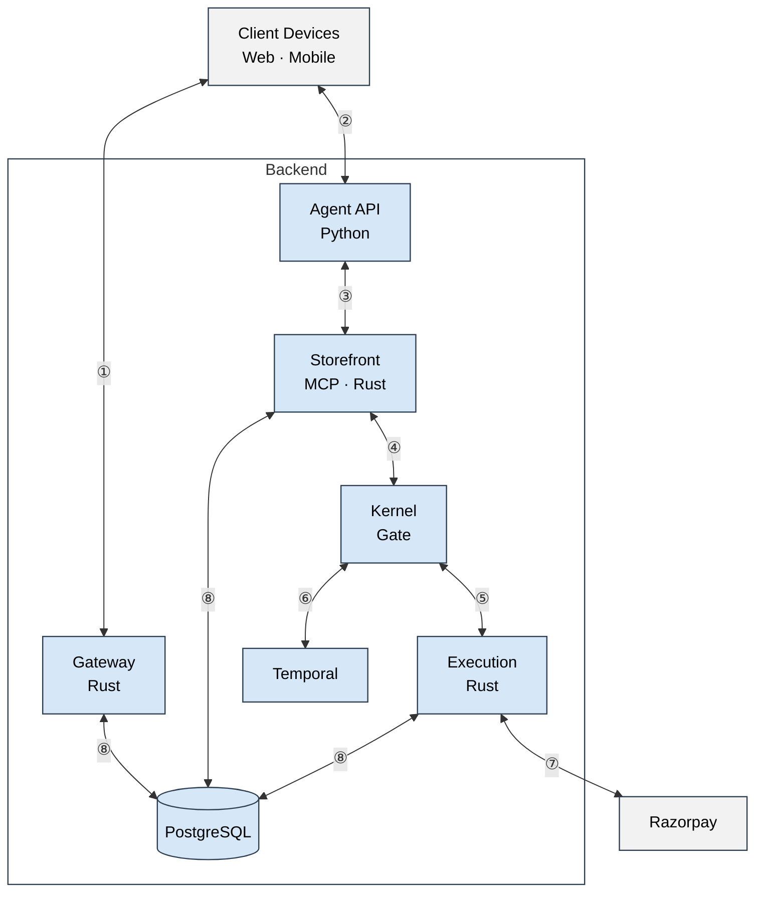

# Paybound — Architecture

① mandate + revoke + audit · ② goal · ③ MCP tool calls · ④ checkout →
evaluate · ⑤ approved → charge · ⑥ &gt;₹15,000 pause/resume · ⑦ payment link +
webhook · ⑧ persist + audit chain
