# Paybound — Full End-to-End Architecture

Top to bottom, in the exact order a real purchase flows: the human grants
bounded authority, the AI agent reasons and proposes, **the deterministic
kernel is the one gate every rupee passes through**, the execution plane
charges Razorpay idempotently, and every step lands in a tamper-evident,
product-detailed audit chain the human can read and revoke against.

**Colour = which stack owns the node.** Peach = **Rust** (the deterministic
money path). Blue = **Python** (agentic reasoning + ML). Purple = **React
frontend**. Red = **the kernel gate itself** — the crown jewel. Green =
**PostgreSQL**. Teal = **Temporal**. Light-blue = **Razorpay (external)**.

```mermaid
flowchart TD

%% ───────────────────────── CLIENT / HUMAN ─────────────────────────
    subgraph CLIENT["👤 Client &amp; Human Layer — React + TypeScript + Vite · :5173"]
        Human(["🧑 Human Buyer"])
        MandateUI["<b>Consent &amp; Mandate Console</b><br/><i>grant budget · category · TTL · REVOKE</i>"]
        ShopUI["<b>Conversational Shop Console</b><br/><i>NL goal · CHOOSE · UPSELL · live pipeline (SSE)</i>"]
        AuditUI["<b>Audit Trail Viewer</b><br/><i>grouped-by-cart · hash-verified · product detail</i>"]
    end
    Human -->|"grant / revoke authority"| MandateUI
    Human -->|"'buy running shoes under 3000'"| ShopUI
    Human -->|"inspect every rupee"| AuditUI

%% ───────────────────────── GATEWAY ─────────────────────────
    subgraph GATEWAY["🚪 Gateway — Rust · axum · :8080"]
        Identity["<b>Identity</b><br/><i>bearer token</i>"]
        MandateEP["<b>Mandate Lifecycle</b><br/><i>ed25519 sign · list · REVOKE</i>"]
        AuditEP["<b>Audit Read API</b><br/><i>hash-verified chain</i>"]
        WebhookEP["<b>Webhook Receiver</b><br/><i>HMAC-SHA256 · raw body</i>"]
    end
    MandateUI -->|"POST /identity · /mandates"| Identity
    MandateUI -->|"POST /mandates/:id/revoke"| MandateEP
    AuditUI -->|"GET /sessions/:id/audit"| AuditEP

%% ───────────────────────── BUYER AGENT (PYTHON) ─────────────────────────
    subgraph AGENT["🧠 Buyer Agent — Python · FastAPI · :8092"]
        Precheck["<b>Deterministic Pre-checks</b><br/><i>valid? revoked? expired? · ZERO LLM calls</i>"]
        Orchestrator["<b>Orchestrator</b><br/><i>owns the flow · the ONLY caller of checkout</i>"]
        Workers["<b>Workers</b><br/><i>Discovery · Cart Composer · Clarification</i>"]
        CampaignEng["<b>Campaign Engine</b><br/><i>win-back / complete-the-set · never touches money</i>"]
    end

    subgraph ML["📦 Trained Models + LLM — loaded in-process, no network hop"]
        Gemini["<b>Gemini LLM</b><br/><i>goal parse + audit narration · heuristic fallback</i>"]
        Relevance["<b>Relevance Ranker</b><br/><i>XGBoost · Amazon ESCI · relevance-margin filter</i>"]
        Upsell["<b>Upsell Model</b><br/><i>Instacart + ESCI-C + Reviews · MiniLM bridge</i>"]
        Confidence["<b>Confidence Scorer</b><br/><i>gradient-boosted</i>"]
    end

    ShopUI -->|"POST /sessions/:id/run"| Precheck
    Precheck -->|"pass"| Orchestrator
    Precheck -.->|"reject — typed reason, 0 LLM"| ShopUI
    Orchestrator --> Workers
    Orchestrator -->|"parse goal → 1..N intents"| Gemini
    Workers -->|"rerank + relevance-filter"| Relevance
    Workers -->|"complement · value-rank"| Upsell
    Workers -->|"score purchase confidence"| Confidence
    ShopUI -->|"GET /campaign"| CampaignEng

%% ───────────────────────── MCP STOREFRONT (RUST) ─────────────────────────
    subgraph STORE["🏪 Merchant Storefront — MCP · Rust · axum · :8081"]
        MCP["<b>MCP Tools · JSON-RPC 2.0</b><br/><i>search_catalog · get_availability · get_variants · create_cart · checkout</i>"]
        Discovery2["<b>Agent Discovery Surface</b><br/><i>agents.txt · ARD manifest · schema.org JSON-LD · product feed</i>"]
    end
    Workers -->|"MCP tool calls (HTTP JSON-RPC)"| MCP
    Orchestrator ==>|"checkout — the ONLY money call"| MCP
    MCP -.->|"advertised to any external agent"| Discovery2

%% ───────────────────────── TRUST CORE (RUST) ─────────────────────────
    subgraph TRUST["🛡️ Trust Core — Rust · the crown jewel"]
        Kernel{{"<b>Mandate &amp; Consent Kernel · HARD GATE</b><br/><i>pure fn · zero I/O · deterministic</i><br/>signature → TTL → cart integrity → category →<br/>merchant → per-txn cap → cumulative budget → AFA → revoked"}}
        Signing["<b>ed25519 Verify</b><br/><i>signed Intent Mandate</i>"]
        Reserve["<b>Reserve-Pay Ledger</b><br/><i>SIMULATED fund-block · block → multi-debit → revoke</i>"]
    end
    MCP ==>|"evaluate(cart, mandate, spend, now)"| Kernel
    Kernel -->|"verify signature"| Signing
    Kernel -->|"cumulative cap vs running spend"| Reserve
    Kernel -.->|"Refused(reason) / NeedsHuman — typed"| Orchestrator

%% ───────────────────────── EXECUTION PLANE (RUST) ─────────────────────────
    subgraph EXEC["💳 Execution Plane — Rust · ACP shared-token pattern"]
        PayOrch["<b>Payment Orchestrator</b><br/><i>idempotent · ON CONFLICT claim</i>"]
        Token["<b>Delegated Token Issuer</b><br/><i>scoped · single-use · 256-bit CSPRNG</i>"]
    end
    Kernel ==>|"Approved(Authorization)"| PayOrch
    PayOrch --> Token

%% ───────────────────────── DURABLE WORKFLOW ─────────────────────────
    subgraph WF["⏱️ Durable Workflow — Temporal"]
        Approval["<b>PurchaseApprovalWorkflow</b><br/><i>&gt; ₹15,000 AFA · survives crash/restart · exactly-once</i>"]
    end
    Kernel -->|"needs_human (&gt; ₹15k)"| Approval
    Approval -->|"human approves"| PayOrch

%% ───────────────────────── RAZORPAY (EXTERNAL) ─────────────────────────
    Razorpay[("🔵 Razorpay — Test-Mode REST<br/><i>Payment Links · Orders · webhooks</i>")]
    PayOrch -->|"create_payment_link"| Razorpay
    Razorpay -->|"payment_link.paid"| WebhookEP
    WebhookEP -->|"on_payment_paid → COMPLETED"| PayOrch

%% ───────────────────────── DATA LAYER ─────────────────────────
    subgraph DATA["🗄️ Data Layer — PostgreSQL 16 + pgvector"]
        PG[("<b>PostgreSQL</b><br/><i>catalog · intent/payment mandates · sessions · carts · runs · offers</i>")]
        Audit[("<b>Hash-chained Audit Ledger</b><br/><i>SHA-256 linked · product line_items · verify_chain()</i>")]
        Vec[("<b>pgvector index</b><br/><i>MiniLM catalog embeddings · semantic search</i>")]
    end
    MCP <-->|"catalog · availability"| PG
    MCP -->|"semantic nearest-neighbour"| Vec
    MandateEP --> PG
    PayOrch -.->|"Payment Mandate — closes the AP2 chain"| PG
    Precheck -.->|"session_created"| Audit
    MCP -.->|"cart_built · gate_decision (+ product detail)"| Audit
    PayOrch -.->|"token_issued · payment_effect"| Audit
    AuditEP --> Audit

%% ───────────────────────── EXPLANATION ─────────────────────────
    subgraph EXPLAIN["🗣️ Explanation Service — Python"]
        Narrator["<b>Audit Narrator</b><br/><i>describes, NEVER decides · narrative lives outside the hash</i>"]
    end
    Audit -.->|"fire-and-forget, async"| Narrator
    Narrator -.->|"plain-language sentence"| Audit
    Audit ==>|"verify_chain() = PASS"| AuditUI

%% ───────────────────────── REVOCATION LOOP ─────────────────────────
    Human -.->|"REVOKE — next attempt blocked"| MandateEP
    MandateEP -.->|"revoked_at"| PG

%% ───────────────────────── OBSERVABILITY ─────────────────────────
    subgraph OBS["📊 Observability"]
        OTel["<b>OpenTelemetry → Collector → Tempo → Grafana</b><br/><i>money-path traces: agent → MCP → kernel → Razorpay</i>"]
    end
    AGENT -.-> OTel
    STORE -.-> OTel
    EXEC -.-> OTel

%% ───────────────────────── STYLING ─────────────────────────
    classDef rust fill:#ffedd5,stroke:#c2410c,color:#7c2d12,stroke-width:1.5px
    classDef python fill:#dbeafe,stroke:#1d4ed8,color:#1e3a8a,stroke-width:1.5px
    classDef frontend fill:#ede9fe,stroke:#6d28d9,color:#4c1d95,stroke-width:1.5px
    classDef db fill:#dcfce7,stroke:#15803d,color:#14532d,stroke-width:1.5px
    classDef kernel fill:#fee2e2,stroke:#b91c1c,color:#7f1d1d,stroke-width:3px
    classDef workflow fill:#ccfbf1,stroke:#0f766e,color:#134e4a,stroke-width:1.5px
    classDef external fill:#e0f2fe,stroke:#0369a1,color:#0c4a6e,stroke-width:1.5px
    classDef obs fill:#f1f5f9,stroke:#475569,color:#1e293b,stroke-width:1.5px
    classDef human fill:#ffffff,stroke:#111827,color:#111827,stroke-width:2px

    class Human human
    class MandateUI,ShopUI,AuditUI frontend
    class Identity,MandateEP,AuditEP,WebhookEP,MCP,Discovery2,PayOrch,Token,Signing,Reserve rust
    class Precheck,Orchestrator,Workers,CampaignEng,Gemini,Relevance,Upsell,Confidence,Narrator python
    class Kernel kernel
    class Approval workflow
    class Razorpay external
    class PG,Audit,Vec db
    class OTel obs

    style CLIENT fill:#faf5ff,stroke:#c4b5fd,color:#4c1d95
    style GATEWAY fill:#fff7ed,stroke:#fdba74,color:#7c2d12
    style AGENT fill:#eff6ff,stroke:#93c5fd,color:#1e3a8a
    style ML fill:#eff6ff,stroke:#93c5fd,color:#1e3a8a
    style STORE fill:#fff7ed,stroke:#fdba74,color:#7c2d12
    style TRUST fill:#fef2f2,stroke:#fca5a5,color:#7f1d1d
    style EXEC fill:#fff7ed,stroke:#fdba74,color:#7c2d12
    style WF fill:#f0fdfa,stroke:#5eead4,color:#134e4a
    style DATA fill:#f0fdf4,stroke:#86efac,color:#14532d
    style EXPLAIN fill:#eff6ff,stroke:#93c5fd,color:#1e3a8a
    style OBS fill:#f8fafc,stroke:#cbd5e1,color:#1e293b
```

## Reading it, stage by stage

1. **Grant authority.** The human signs an **Intent Mandate** in the Consent
   Console — budget, per-txn cap, allowed categories/merchants, TTL — which the
   Gateway signs with **ed25519** and persists. This is the bounded envelope
   the agent may act *only* inside.
2. **State a goal.** The Shop Console sends a natural-language goal to the Agent
   API, streamed live over SSE.
3. **Pre-checks, before any LLM call.** Mandate valid, not revoked, not expired,
   not prompt-injection. A rejection here costs **zero** LLM calls.
4. **Reason.** The LLM parses the goal into one or more product intents; the
   Discovery worker searches the real catalog (bounded, semantically reranked,
   relevance-margin filtered); the Cart Composer proposes a cart and a
   value-ranked upsell, scored by the confidence model.
5. **The agent has no money tool.** Every catalog and cart action funnels
   through the MCP storefront's tools — the same surface any external agent
   would use.
6. **The kernel gate.** `checkout` hands the exact cart to the **Mandate &
   Consent Kernel** — a pure, zero-I/O function running nine checks in a fixed
   order. This is the one node every rupee passes through, and it is
   *structurally* incapable of being bypassed.
7. **Approved → Execution Plane → Razorpay.** A single-use delegated token, a
   real test-mode payment link, idempotent by an `ON CONFLICT` claim so a retry
   never double-charges.
8. **Over ₹15,000 → Temporal.** The purchase pauses durably for human approval,
   survives a worker crash, and resumes exactly once.
9. **Settle & explain.** The HMAC-verified webhook completes the session. Every
   step is appended to the **SHA-256 hash-chained audit ledger** — carrying the
   real product name, category, and price, not just a total. The Narrator writes
   a plain-language sentence per entry, *outside* the hash, so it can never
   affect a money outcome.
10. **Read & revoke.** The human reads the verified chain, and a one-click
    revoke blocks the agent's very next attempt — live, not eventually.
